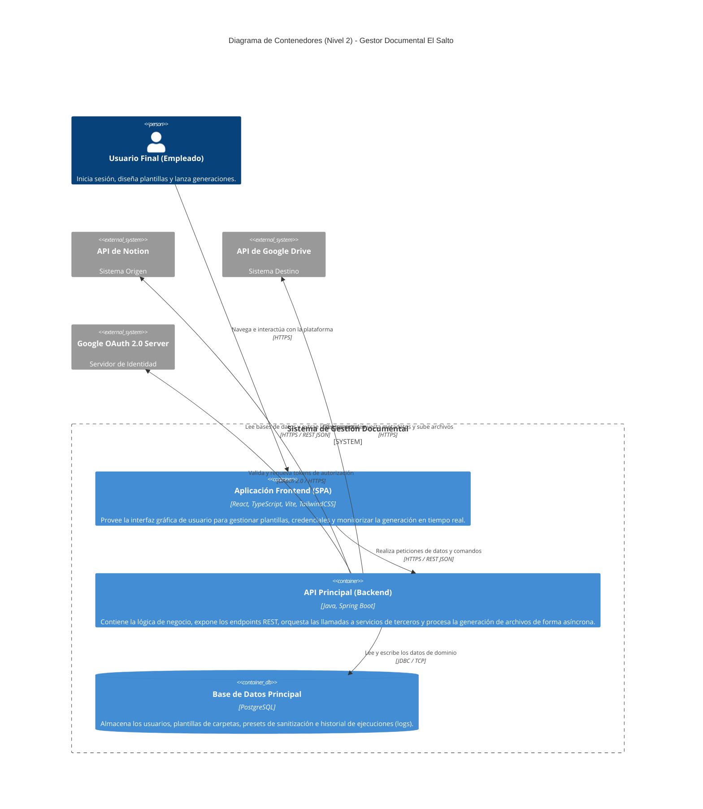

```mermaid
C4Container
    title Diagrama de Contenedores (Nivel 2) - Gestor Documental El Salto

    Person(usuario, "Usuario Final (Empleado)", "Inicia sesión, diseña plantillas y lanza generaciones.")

    System_Boundary(gestor_boundary, "Sistema de Gestión Documental") {
        Container(frontend, "Aplicación Frontend (SPA)", "React, TypeScript, Vite, TailwindCSS", "Provee la interfaz gráfica de usuario para gestionar plantillas, credenciales y monitorizar la generación en tiempo real.")
        
        Container(backend, "API Principal (Backend)", "Java, Spring Boot", "Contiene la lógica de negocio, expone los endpoints REST, orquesta las llamadas a servicios de terceros y procesa la generación de archivos de forma asíncrona.")
        
        ContainerDb(database, "Base de Datos Principal", "PostgreSQL", "Almacena los usuarios, plantillas de carpetas, presets de sanitización e historial de ejecuciones (logs).")
    }

    System_Ext(notion_api, "API de Notion", "Sistema Origen")
    System_Ext(google_drive_api, "API de Google Drive", "Sistema Destino")
    System_Ext(google_oauth, "Google OAuth 2.0 Server", "Servidor de Identidad")

    Rel(usuario, frontend, "Navega e interactúa con la plataforma", "HTTPS")
    Rel(frontend, backend, "Realiza peticiones de datos y comandos", "HTTPS / REST JSON")
    Rel(backend, database, "Lee y escribe los datos de dominio", "JDBC / TCP")
    
    Rel(backend, notion_api, "Lee bases de datos y extrae URLs temporales", "HTTPS / REST JSON")
    Rel(backend, google_oauth, "Valida y renueva tokens de autorización", "OAuth 2.0 / HTTPS")
    Rel(backend, google_drive_api, "Crea carpetas, inyecta metadatos y sube archivos", "HTTPS")
```
