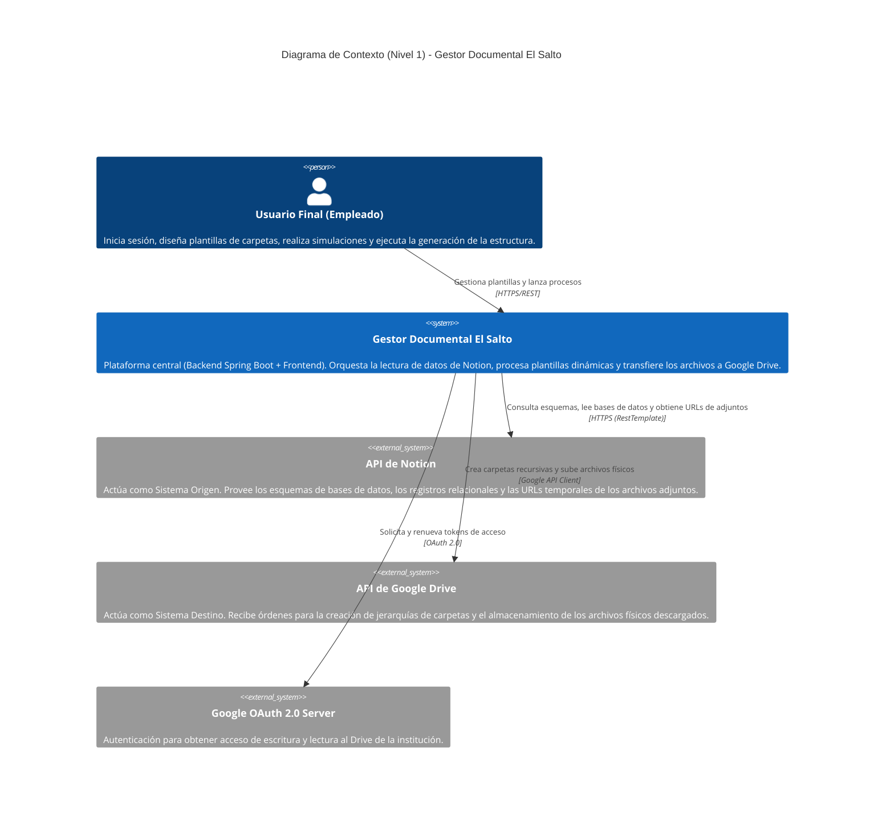

```mermaid
C4Context
    title Diagrama de Contexto (Nivel 1) - Gestor Documental El Salto

    Person(usuario, "Usuario Final (Empleado)", "Inicia sesión, diseña plantillas de carpetas, realiza simulaciones y ejecuta la generación de la estructura.")

    System(gestor_documental, "Gestor Documental El Salto", "Plataforma central (Backend Spring Boot + Frontend). Orquesta la lectura de datos de Notion, procesa plantillas dinámicas y transfiere los archivos a Google Drive.")

    System_Ext(notion_api, "API de Notion", "Actúa como Sistema Origen. Provee los esquemas de bases de datos, los registros relacionales y las URLs temporales de los archivos adjuntos.")
    
    System_Ext(google_drive_api, "API de Google Drive", "Actúa como Sistema Destino. Recibe órdenes para la creación de jerarquías de carpetas y el almacenamiento de los archivos físicos descargados.")

    System_Ext(google_oauth, "Google OAuth 2.0 Server", "Autenticación para obtener acceso de escritura y lectura al Drive de la institución.")

    Rel(usuario, gestor_documental, "Gestiona plantillas y lanza procesos", "HTTPS/REST")
    Rel(gestor_documental, notion_api, "Consulta esquemas, lee bases de datos y obtiene URLs de adjuntos", "HTTPS (RestTemplate)")
    Rel(gestor_documental, google_oauth, "Solicita y renueva tokens de acceso", "OAuth 2.0")
    Rel(gestor_documental, google_drive_api, "Crea carpetas recursivas y sube archivos físicos", "Google API Client")
```
